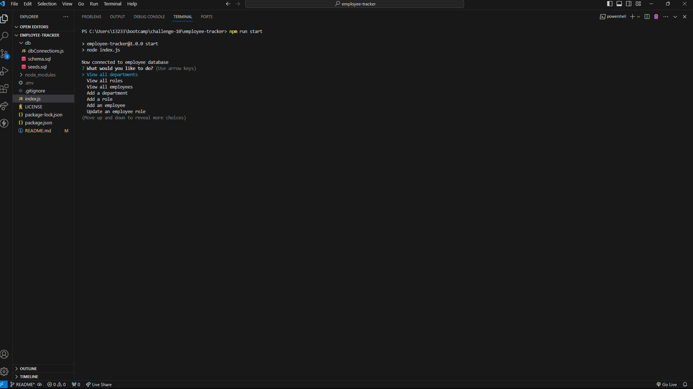

# Employee Tracker Database


## Description

The purpose of this project is to learn how to use MySQL in conjunction with Inquirer to build a manager program for an employee database. The motivation for this project was to enhance back-end programming and solidify an understanding of MySQL and Inquirer. This project was built to create an application that manages a sample employee database created using MySQL by using Inquirer prompts and database queries. The problem this project solves is creating an effective program that allows companies and businesses to manage their employees, departments, and employee roles. 

## Installation

To install this project, users should open the integrated terminal and type the command "npm i" in order to install all necessary dependencies used in this program. To run the program in VSCode and launch the user prompts, enter the following command in the integrated terminal after all packages have been installed:
````
npm run start
````

## Usage

As this is project uses seeded data to test the functionality of the program, users should first connect to the database by entering the command "mysql -u root". Once connected to MySQL, users will build the database template with seeded data by entering the commands "SOURCE ./schema.sql;" followed by "SOURCE ./seeds.sql;". Use the command "quit" to exit the MySQL terminal and launch the program within the integrated terminal with the command listed above in the "Installation" section. Users wil then note that a menu prompt appears which allows users to navigate up and down the selections using arrow keys. Users may view a list of departments, roles, and employees from the menu; the options to add a department, add a role, add an employee, and update an employee role is also available. If the user wishes to make any changes to the employee database, further prompts will appear upon selection of the action and will reflect in the database if successfully added. To exit the program, an "Exit" option is available in the home menu. 

## Credits

MySQL for the open-source relational database management system. Inquirer for the command line prompt interface used navigate users throughout the database program. Megan Meyers for assistance in using some Inquirer and MySQL syntax for smooth integration. 

## Link(s)

https://github.com/chriswaje/employee-tracker (Link to employee database)


## Image(s)

